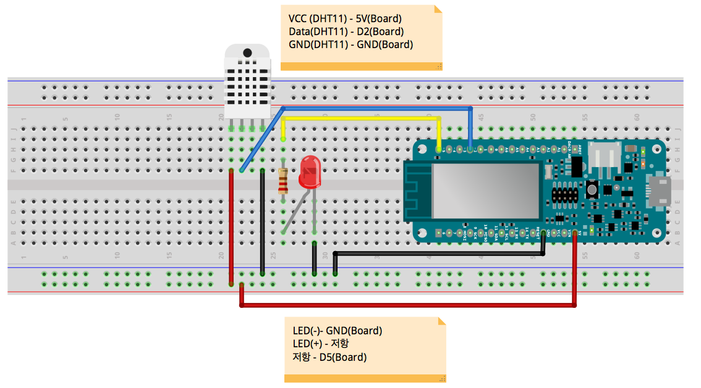
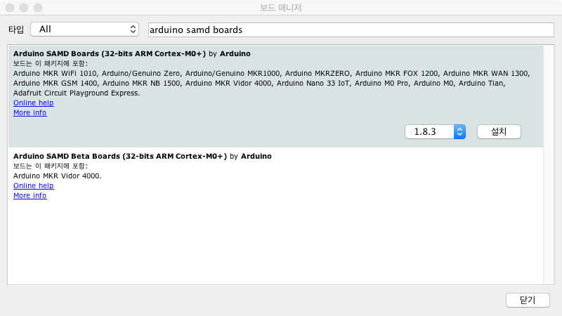
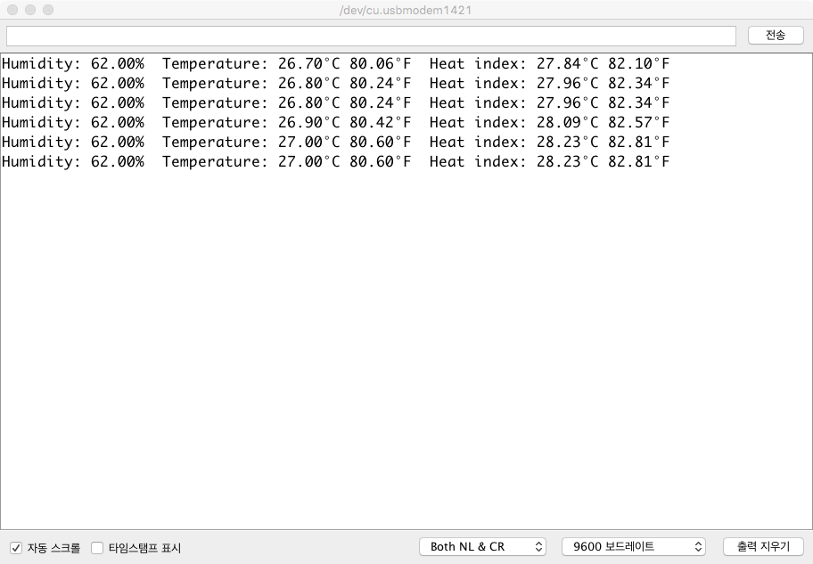

# LED와 DHT-11 센서를 포함한 MKR WiFi 1010 보드 설정하기

## 1. 하드웨어 구성



1. LED 제어 배선
	- **아두이노 MKR1010**의 **GND**를 **LED 음극**(캐소드, 짧은 단자)에 연결
	- **LED 양극**(애노드, 긴 단자)을 **저항 (330~1K 옴)**에 연결
	- 저항의 나머지 한 끝을 **아두이노 MKR1010**의 디지털입출력핀 **D5** 연결

2. DHT-11 온습도 센서
	- **아두이노 MKR1010**의 **5V**를 **DHT-11**의 **VCC** 핀과 연결
	- **아두이노 MKR1010**의 **D2** (디지털입출력핀 2)를 **DHT-11**의 **Data** 핀과 연결
	- **아두이노 MKR1010**의 **GND**를 **DHT-11**의 **GND** 핀과 연결

## 2. MKR WIFI 1010 설정
- 	**아두이노 MKR1010** 보드를 사용하기 위해서는 **Arduino SAMD Boards**를 보드 매니저를 통해 설치해야 합니다.
	- **툴-보드-보드매니저**를 선택하여 보드 매니저를 실행한 후에, 검색 창에  *Arduino SAMD Boards*를 입력한 후, 검색된 보드를 설치한다.

	

## 3.DHT-11 라이브러리 설치
- **DHT-11**을 사용하기 위해서는 다음 두가지 라이브러리가 설치되어야 합니다.
	- Adafruit Unified Sensor
	- DHT sensor library
- 라이브러리 설치 방법
	- **Arduino IDE**의 **스케치-라이브러리 포함하기-라이브러리 관리** 메뉴 클릭
	- 검색 창에서 위의 두가지 라이브러리를 검색하여 설치

		

## 4. 테스트

### 4.1 LED 테스트
- 디지털입출력 5번핀에 연결된 LED를 1초마다 깜박이게 하는 코드

	```c
	#define PIN_LED    5

	void setup() {
	  pinMode(PIN_LED, OUTPUT);
	}

	void loop() {
	  digitalWrite(PIN_LED,HIGH);
	  delay(1000);
	  digitalWrite(PIN_LED,LOW);
	  delay(1000);
	}
	```
- LED가 1초마다 깜박이는 지를 확인해 본다.

### 4.2 DHT-11 테스트

```c
#include "DHT.h"

#define DHTPIN 2     // Digital pin connected to the DHT sensor

#define DHTTYPE DHT11   // DHT 11

DHT dht(DHTPIN, DHTTYPE);

void setup() {
  Serial.begin(9600);
  Serial.println(F("DHTxx test!"));

  dht.begin();
}

void loop() {
  // Wait a few seconds between measurements.
  delay(2000);

  // Reading temperature or humidity takes about 250 milliseconds!
  // Sensor readings may also be up to 2 seconds 'old' (its a very slow sensor)
  float h = dht.readHumidity();
  // Read temperature as Celsius (the default)
  float t = dht.readTemperature();
  // Read temperature as Fahrenheit (isFahrenheit = true)
  float f = dht.readTemperature(true);

  // Check if any reads failed and exit early (to try again).
  if (isnan(h) || isnan(t) || isnan(f)) {
    Serial.println(F("Failed to read from DHT sensor!"));
    return;
  }

  // Compute heat index in Fahrenheit (the default)
  float hif = dht.computeHeatIndex(f, h);
  // Compute heat index in Celsius (isFahreheit = false)
  float hic = dht.computeHeatIndex(t, h, false);

  Serial.print(F("Humidity: "));
  Serial.print(h);
  Serial.print(F("%  Temperature: "));
  Serial.print(t);
  Serial.print(F("°C "));
  Serial.print(f);
  Serial.print(F("°F  Heat index: "));
  Serial.print(hic);
  Serial.print(F("°C "));
  Serial.print(hif);
  Serial.println(F("°F"));
}
```
- 시리얼 모니터 창을 열어 결과를 확인해 본다.
	
