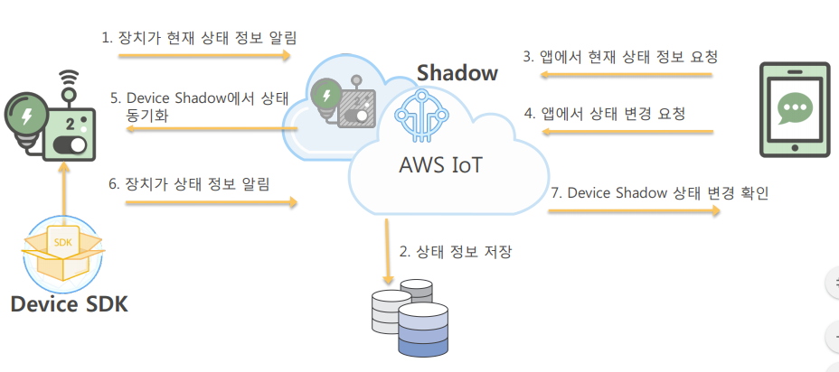
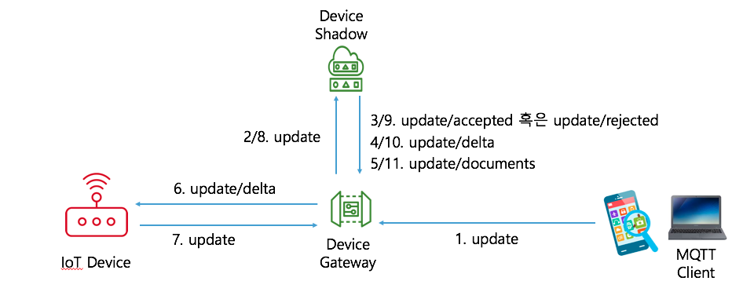

# 디바이스 섀도우 서비스 실습

<a name="1"></a>
## 1. 개요
- **사물**이란 물리적 디바이스를 클라우드에서 표현하고 기록한 것입니다. 물리적 디바이스와 **AWS IoT**의 호환을 위해서는 사물 레코드가 필요합니다.
- **AWS IoT 디바이스 섀도우 서비스**는 AWS IoT 사물 객체에 **섀도우**를 추가합니다.
- **섀도우**는 디바이스, 앱 및 기타 클라우드 서비스가 데이터를 공유할 수 있는 신뢰할 수 있는 데이터 스토어를 제공합니다.
	-  AWS IoT에 연결되어 있는 동안 디바이스, 앱 및 기타 클라우드 서비스가 해당 섀도우를 통해 디바이스의 현재 상태에 액세스하고 제어할 수 있습니다.

		

	- 섀도우를 사용하면 디바이스가 AWS IoT에 연결되어 있는지 여부에 관계없이 앱 및 기타 서비스에서 디바이스의 상태를 사용할 수 있습니다.
		- 디바이스가 다시 연결되면 섀도우의 현재 상태를 수신하여 섀도우와 일치하도록 상태를 업데이트한 다음 업데이트된 상태로 메시지를 게시할 수 있습니다.
		- 마찬가지로 앱이 오프라인으로 전환되고 오프라인 상태인 동안 디바이스 상태가 변경된 경우, 디바이스는 섀도우를 업데이트하여 앱이 다시 연결될 때 섀도우에 현재 상태를 쿼리하도록 할 수 있습니다.

<a name="2"></a>
## 2. 디바이스 섀도우 서비스를 이용한 디바이스 상태 수집 및 제어

---
### 2.1 디바이스 섀도우 서비스
- **디바이스 섀도우 서비스**는 중간 역할을 수행하여 디바이스와 애플리케이션이 디바이스의 현재 상태 정보를 검색하고 업데이트할 수 있게 합니다.

- **AWS IoT**는(은) 디바이스 섀도우 작업을 위한 세 가지 메서드를 제공합니다.
	- **UPDATE**
		- 디바이스 섀도우가 존재하지 않을 경우 디바이스 섀도우를 생성
		- 요청에 의해 요구된 데이터로 디바이스 섀도우의 내용을 변경
		- 데이터는 마지막으로 변경된 시간을 나타내는 타임 스탬프 정보와 함께 저장됨
	- **GET**
		- 디바이스 섀도우에 저장된 최신 상태를 검색합니다.
		- 이 메서드는 메타데이터를 포함하여 전체 JSON 문서를 반환합니다.
	- **DELETE**
		- 디바이스 새도우를 모든 내용을 포함하여 삭제합니다.
- **프로토콜 지원**
	-  **MQTT**와 **HTTPS를 통한 RESTful API** 모두에서 지원
	-  **MQTT 주제**
		- [/update](https://docs.aws.amazon.com/ko_kr/iot/latest/developerguide/device-shadow-mqtt.html#update-pub-sub-topic)
		- [/update/accepted](https://docs.aws.amazon.com/ko_kr/iot/latest/developerguide/device-shadow-mqtt.html#update-accepted-pub-sub-topic)
		- [/update/documents](https://docs.aws.amazon.com/ko_kr/iot/latest/developerguide/device-shadow-mqtt.html#update-documents-pub-sub-topic)
		- [/update/rejected](https://docs.aws.amazon.com/ko_kr/iot/latest/developerguide/device-shadow-mqtt.html#update-rejected-pub-sub-topic)
		- [/update/delta](https://docs.aws.amazon.com/ko_kr/iot/latest/developerguide/device-shadow-mqtt.html#update-delta-pub-sub-topic)
		- [/get](https://docs.aws.amazon.com/ko_kr/iot/latest/developerguide/device-shadow-mqtt.html#get-pub-sub-topic)
		- [/get/accepted](https://docs.aws.amazon.com/ko_kr/iot/latest/developerguide/device-shadow-mqtt.html#get-accepted-pub-sub-topic)
		- [/get/rejected](https://docs.aws.amazon.com/ko_kr/iot/latest/developerguide/device-shadow-mqtt.html#get-rejected-pub-sub-topic)
		- [/delete](https://docs.aws.amazon.com/ko_kr/iot/latest/developerguide/device-shadow-mqtt.html#delete-pub-sub-topic)
		- [/delete/accepted](https://docs.aws.amazon.com/ko_kr/iot/latest/developerguide/device-shadow-mqtt.html#delete-accepted-pub-sub-topic)
		- [/delete/rejected](https://docs.aws.amazon.com/ko_kr/iot/latest/developerguide/device-shadow-mqtt.html#delete-rejected-pub-sub-topic)

---
### 2.2 디바이스 섀도우 서비스 사용 시나리오
- 디바이스 상태가 변경되는 경우
- 애플리케이션이 디바이스의 상태 정보를 요청하는 경우
- 애플리케이션이 디바이스의 상태 변경을 요청하는 경우

---
#### 2.2.1 디바이스 상태가 변경되는 경우


1. 전구가 온라인 상태가 되면 전구는 MQTT 메시지를 **$aws/things/myLightBulb/shadow/update** 주제로 전송하여 현재 상태를 다음 형식의 메시지로 디바이스 섀도우 서비스에 알립니다.

	```json
	{
	    "state": {
	        "reported": {
	            "color": "red"
	        }
	    }
	}
	```
	- 이 메시지가 전구 색상을 "**빨간색**"으로 설정하였음을 나타냅니다.


2. 디바이스 섀도우 서비스가 다음 메시지를 **$aws/things/myLightBulb/shadow/update/accepted** 주제로 전송하여 **응답**합니다.

	```json
	{
	  "messageNumber": 4,
	  "payload": {
	    "state": {
	      "reported": {
	        "color": "red"
	      }
	    },
	    "metadata": {
	      "reported": {
	        "color": {
	          "timestamp": 1469564492
	        }
	      }
	    },
	    "version": 1,
	    "timestamp": 1469564492
	  },
	  "qos": 0,
	  "timestamp": 1469564492848,
	  "topic": "$aws/things/myLightBulb/shadow/update/accepted"
	}
	```

	- 이 메시지는 디바이스 섀도우 서비스가 UPDATE 요청을 수신하여 디바이스 섀도우의 업데이트를 승인했음을 나타냅니다.


3. 디바이스 섀도우에 대한 업데이트가 성공적으로 완료되면, 디바이스 섀도우 서비스가 다음 메시지를 **$aws/things/myLightBulb/shadow/update/documents** 주제에 게시합니다.

	```json
	{
	    "previous":null,
	    "current":{
	        "state":{
	            "reported":{
	                "color":"red"
	            }
	         },
	         "metadata":{
	            "reported":{
	                "color":{
	                    "timestamp":1483467764
	                }
	            }
	         },
	         "version":1
	     },
	     "timestamp":1483467764
	}
	```

- [**실습**] 이 시나리오를 시뮬레이션하기 위해서  **AWS IoT MQTT Client**를 사용하여 다음 절차를 수행합니다.

	1. 다음 두 개의 주제를 구독합니다.
		- $aws/things/myLightBulb/shadow/update/accepted
		- $aws/things/myLightBulb/shadow/update/documents
	2. $aws/things/myLightBulb/shadow/update 주제에 아래 메시지를 게시합니다.

		```json
		{
		    "state": {
		        "reported": {
		            "color": "red"
		        }
		    }
		}
		```
	3. 아래 두 주제와 관련된 메시지 수신을 확인합니다.
		- $aws/things/myLightBulb/shadow/update/accepted
		- $aws/things/myLightBulb/shadow/update/documents

---
#### 2.2.2 애플리케이션이 디바이스의 상태 정보를 요청하는 경우


1. 전구와 상호 작용하는 애플리케이션이 온라인 상태가 되고 **전구의 현재 상태를 요청**합니다.
	- **$aws/things/myLightBulb/shadow/get** 주제에 빈 메시지("")를 게시

2. 디바이스 섀도우 서비스가 **$aws/things/myLightBulb/shadow/get/accepted** 주제에 요청된 섀도우를 게시하여 응답합니다.

	```json
	{
	  "messageNumber": 1,
	  "payload": {
	    "state": {
	      "reported": {
	        "color": "red"
	      }
	    },
	    "metadata": {
	      "reported": {
	        "color": {
	          "timestamp": 1469564492
	        }
	      }
	    },
	    "version": 1,
	    "timestamp": 1469564571
	  },
	  "qos": 0,
	  "timestamp": 1469564571533,
	  "topic": "$aws/things/myLightBulb/shadow/get/accepted"
	}
	```

- [**실습**] 이 시나리오를 시뮬레이션하기 위해서  **AWS IoT MQTT Client**를 사용하여 다음 절차를 수행합니다.

	1. 다음의 주제를 구독합니다.
		- $aws/things/myLightBulb/shadow/get/accepted
	2. $aws/things/myLightBulb/shadow/get 주제에 빈 메시지("")를 게시합니다.
	3. $aws/things/myLightBulb/shadow/get/accepted 주제와 관련된 메시지 수신을 확인합니다.

---
#### 2.2.3 애플리케이션이 디바이스의 상태 변경을 요청하는 경우



1. 사용자는 애플리케이션을 통해 **디바이스의 전구 색상 변경(빨간색에서 녹색으로)을 요청**합니다.
	- 이를 위해 애플리케이션이 **$aws/things/myLightBulb/shadow/update** 주제에 아래 메시지를 게시합니다.

		```json
		{
		    "state": {
		        "desired": {
		            "color": "green"
		        }
		    }
		}
		```

2. 디바이스 섀도우 서비스가 다음 메시지를 **$aws/things/myLightBulb/shadow/update/accepted** 주제로 전송하여 응답합니다.

	```json
	{
	  "messageNumber": 5,
	  "payload": {
	    "state": {
	      "desired": {
	        "color": "green"
	      }
	    },
	    "metadata": {
	      "desired": {
	        "color": {
	          "timestamp": 1469564658
	        }
	      }
	    },
	    "version": 2,
	    "timestamp": 1469564658
	  },
	  "qos": 0,
	  "timestamp": 1469564658286,
	  "topic": "$aws/things/myLightBulb/shadow/update/accepted"
	}
	```

3. 섀도우 서비스가 업데이트를 수락한 후 그 업데이트된 섀도우에 포함된 원하는 상태 및 보고된 상태의 값이 서로 다른 경우 디바이스 섀도우 서비스가 **$aws/things/myLightBulb/shadow/update/delta** 주제로 다음 메시지를 게시합니다.

	```json
	{
	  "messageNumber": 1,
	  "payload": {
	    "version": 2,
	    "timestamp": 1469564658,
	    "state": {
	      "color": "green"
	    },
	    "metadata": {
	      "color": {
	        "timestamp": 1469564658
	      }
	    }
	  },
	  "qos": 0,
	  "timestamp": 1469564658309,
	  "topic": "$aws/things/myLightBulb/shadow/update/delta"
	}
	```

4. 새도우의 업데이트가 완료되면 디바이스 섀도우 서비스가 **$aws/things/myLightBulb/shadow/update/documents** 주제에 다음 메시지를 게시합니다.

	```json
	{
	    "previous":{
	      "state":{
	        "reported":{
	          "color":"red"
	        }
	      },
	      "metadata":{
	        "reported":{
	          "color":{
	            "timestamp":1483467764
	          }
	        }
	      },
	      "version":1
	    },
	    "current":{
	      "state":{
	        "desired":{
	          "color":"green"
	        },
	        "reported":{
	          "color":"red"
	        }
	      },
	      "metadata":{
	        "desired":{
	          "color":{
	            "timestamp":1483468612
	          }
	        },
	        "reported":{
	          "color":{
	            "timestamp":1483467764
	          }
	        }
	      },
	      "version":2
	    },
	    "timestamp":1483468612
	}
	```

5. 전구가 **$aws/things/myLightBulb/shadow/update/delta** 주제로 구독하고 있으면, 전구는 메시지를 수신하고, 색상을 변경하고, 새 상태를 게시합니다.

6. 디바이스 섀도우 서비스가 다음 주제로 메시지를 전송하여 응답합니다. **$aws/things/myLightBulb/shadow/update/accepted** 주제로 메시지를 전송합니다.

	```json
	{
	  "messageNumber": 6,
	  "payload": {
	    "state": {
	      "reported": {
	        "color": "green"
	      },
	      "desired": null
	    },
	    "metadata": {
	      "reported": {
	        "color": {
	          "timestamp": 1469564801
	        }
	      },
	      "desired": {
	        "timestamp": 1469564801
	      }
	    },
	    "version": 3,
	    "timestamp": 1469564801
	  },
	  "qos": 0,
	  "timestamp": 1469564801673,
	  "topic": "$aws/things/myLightBulb/shadow/update/accepted"
	}
	```

7. 디바이스 섀도우에 대한 업데이트가 성공적으로 완료되면, 디바이스 섀도우 서비스가 다음 메시지를 **$aws/things/myLightBulb/shadow/update/documents** 주제에 게시합니다.

	```json
	{
	    "previous":{
	    "state":{
	      "reported":{
	        "color":"red"
	      }
	    },
	    "metadata":{
	         "reported":{
	              "color":{
	                  "timestamp":1483470355
	              }
	          }
	      },
	      "version":3
	    },
	    "current":{
	      "state":{
	        "reported":{
	          "color":"green"
	        }
	      },
	      "metadata":{
	        "reported":{
	          "color":{
	            "timestamp":1483470364
	          }
	        }
	      },
	      "version":4
	    },
	    "timestamp":1483470364
	}
	```
- [**실습**] 이 시나리오를 시뮬레이션하기 위해서  **AWS IoT MQTT Client**를 사용하여 다음 절차를 수행합니다.

	1. 다음 세 개의 주제를 구독합니다.
		- $aws/things/myLightBulb/shadow/update/accepted
		- $aws/things/myLightBulb/shadow/update/documents
		- $aws/things/myLightBulb/shadow/update/delta
	2. $aws/things/myLightBulb/shadow/update 주제에 아래 메시지를 게시합니다.

		```json
		{
		    "state": {
		        "desired": {
		            "color": "green"
		        }
		    }
		}
		```

	3. 아래 세 주제와 관련된 메시지 수신을 확인합니다.
		- $aws/things/myLightBulb/shadow/update/accepted
		- $aws/things/myLightBulb/shadow/update/documents
		- $aws/things/myLightBulb/shadow/update/delta

	4. $aws/things/myLightBulb/shadow/update 주제에 다음 메시지를 게시하여 섀도우 상태를 업데이트합니다.

		```json
		{
		    "state":{
		        "reported":{
		            "color":"green"
		        },
		        "desired":null}
		    }
		}
		```
	5. 아래 두 주제와 관련된 메시지 수신을 확인합니다.
		- $aws/things/myLightBulb/shadow/update/accepted
		- $aws/things/myLightBulb/shadow/update/documents
		- 이 때, $aws/things/myLightBulb/shadow/update/documents 주제의 응답메시지에서 다음과 같은 내용이 포함되어 있는지 확인해봅니다.

			```
			{
			  ...
			  "current": {
			    "state": {
			      "reported": {
			        "color": "green"
			      }
			    },
			    ...
			 }
			```
			- 이 메시지는 애플리케이션에 의해 요청 된 내용 (디바이스의 전구 색상 변경(빨간색에서 녹색으로)을 요청)이 반영되었음을 나타냅니다.
