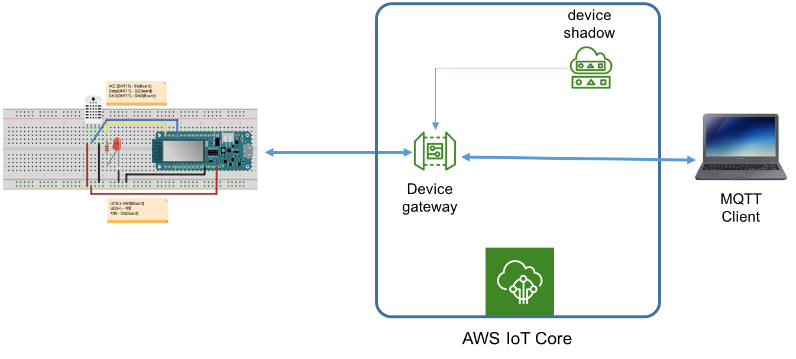
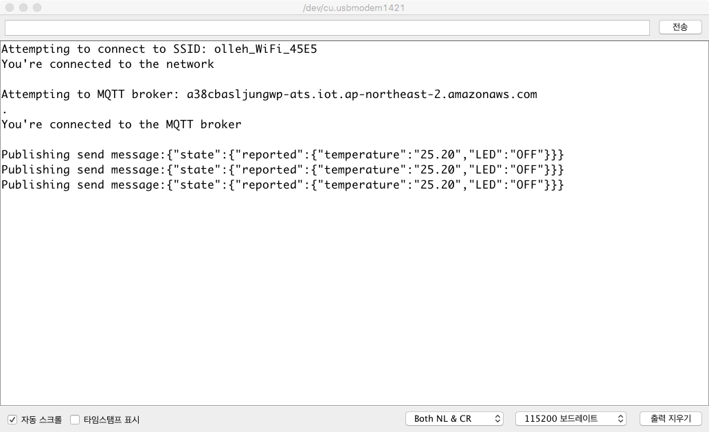
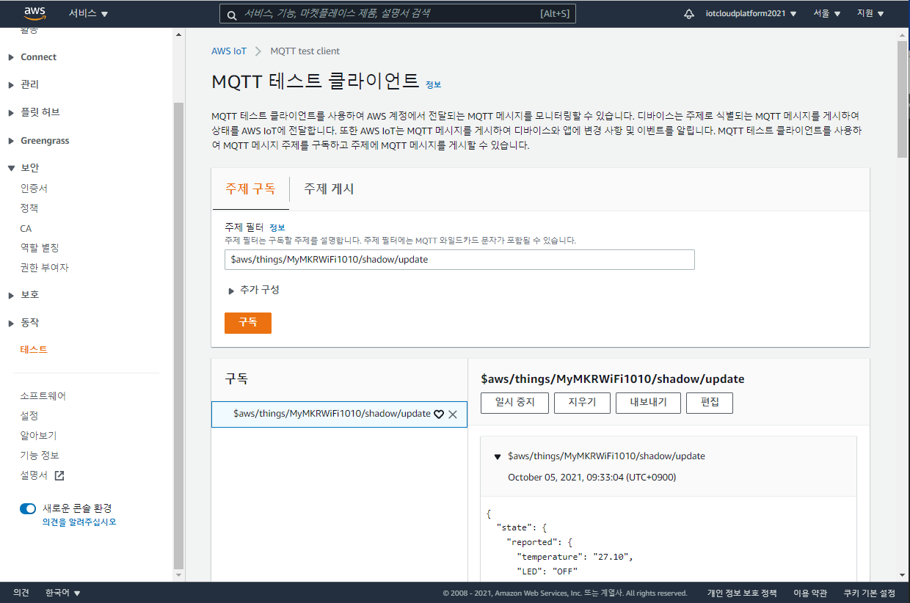
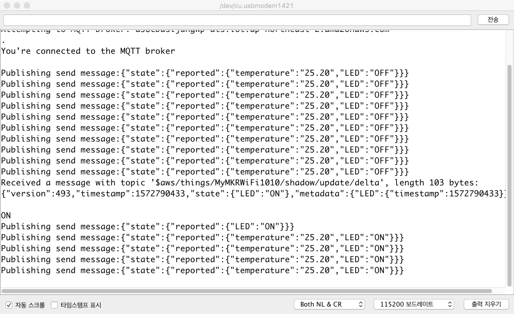

# AWS IoT로 DHT-11 센서 및 LED 제어

##  준비사항
- [LED와 DHT-11 센서를 포함한 MKR WiFi 1010 보드 설정하기](arduino-setting.html)
- 유효한 AWS 계정

---
<a name="1"></a>
## 1. 개요
- 다음과 같이 동작하는 IoT 서비스를 AWS 서비스를 이용하여 구축해 본다.

	- LED와 온습도 센서(DHT-11)를 장착한 아두이노 보드(MKR WiFi1010)를 AWS IoT와 연결
	- 아두이노 보드에서는 AWS IoT와 인증과정을 거친후, 온습도 센서에서 측정된 온습도 값을 매 5초마다 AWS IoT로 전송
	- 외부 MQTT Client를 통해서 아두이노 보드의 LED를 제어

<!--
- AWS IoT는 수집된 온도가 25도를 넘어갈 경우, SNS를 통해 경고 이메일을 전송하고 아두이노 보드의 LED를 ON 시키고, 25도 미만으로 떨어지면, 아두이노 보드의 LED를 다시 OFF 상태로 만듦
-->
- **IoT 서비스 아키텍처**
	

- **사전 학습내용**
	- [AWS IoT Core와 아두이노 (MKR WiFi 1010) 연결하기 실습](aws-arduino-connect.md)
	- [디바이스 섀도우 서비스 실습](device-shadows.md)

## 2. AWS IoT로 온도 값 전송 및 LED 제어 [실습]
### 2.1 아두이노 연결
[AWS IoT Core와 아두이노 (MKR WiFi 1010) 연결하기 실습](aws-arduino-connect.md)에서 수행한 실습 설정을 바탕으로 다음 과정을 진행합니다.

- 필요한 라이브러리 설치
	1. **Arduino IDE**의 **스케치-라이브러리 포함하기-라이브러리 관리** 메뉴 클릭
	2. 검색 창에서 다음 라이브러리를 검색하여 설치
		- ArduinoJson

1. [AWS\_IoT\_DHT11](https://github.com/kwanulee/AWS_IoT_DHT11/archive/refs/heads/main.zip)을 다운로드하여 Arduino IDE에서 실행한다.
2. arduino_secrets.h에서 다음 항목을 사용 환경에 맞도록 수정후, 빌드/업로드 한다.
	- SECRET\_SSID: 무선랜 아이디
	- SECRET\_PASS: 무선랜 패스워드
	- SECRET\_BROKER: AWS IoT broker 엔드포인트
	- SECRET\_CERTIFICATE: 인증서 ([2.5절](#2.5) 참조)
3.  아두이노 IDE의 시리얼 모니터를 열고, 접속이 제대로 이루어지는 지 확인해 본다.
	

### 2.2	디바이스 상태 업데이트 수신 확인
**AWS IoT MQTT Client**를 통해 다음 주제를 구독하여, 현재 디바이스 상태 업데이트가 제대로 수신되는 지를 확인한다.
- 주제: $aws/things/MyMKRWiFi1010/shadow/update

	

- 다음 주제를 추가로 구독하여, 디바이스 섀도우 서비스로부터의 응답을 확인해 본다.
	- $aws/things/MyMKRWiFi1010/shadow/update/accepted
	- $aws/things/MyMKRWiFi1010/shadow/update/documents  

### 2.3 애플리케이션이 디바이스의 **상태 변경을 요청**
**AWS IoT MQTT Client**를 통해 다음 주제와 메시지를 지정하여 게시하여, 아두이노의 LED가 켜지는지 확인한다.
- 주제 : **$aws/things/MyMKRWiFi1010/shadow/update**
- 메시지

	```json
	{
		 "state": {
		     "desired": {
		         "LED": "ON"
		     }
	  }
	}
	```
- 결과 (시리얼 모니터창)
	- 디바이스 섀도우 서비스가 **/update** 요청에 대해 응답하는 **$aws/things/MyMKRWiFi1010/shadow/update/delta** 주제의 메시지를 게시하는데, 아두이노 디바이스에서는 **$aws/things/MyMKRWiFi1010/shadow/update/delta** 주제를 구독하고 있으므로, 아래와 같이 수신된 **update/delta** 메시지를 처리하고 있습니다.   

	
	- AWS\_IoT\_DHT11.ino
		- connectMQTT() 함수 마지막 부분에서 **update/delta** 주제를 구독

		```
		void connectMQTT() {
			...

			// subscribe to a topic
			mqttClient.subscribe("$aws/things/MyMKRWiFi1010/shadow/update/delta");
		}

		```

### 2.4 애플리케이션이 디바이스의 **현재 상태 정보를 요청** 하는 경우
**AWS IoT MQTT Client**를 통해 다음 주제와 메시지를 지정하여 게시하여, 디바이스의 현재 상태를 얻어온다.

- 주제: **$aws/things/MyMKRWiFi1010/shadow/get**
- 메시지: ""

- 결과 확인 방법
	- **AWS IoT MQTT Client**를 통해 다음 주제를 구독하면, 수신되는 응답 상태 문서에서 디바이스의 현재 상태를 확인할 수 있다.
		- 구독 주제: **$aws/things/MyMKRWiFi1010/shadow/get/accepted**
